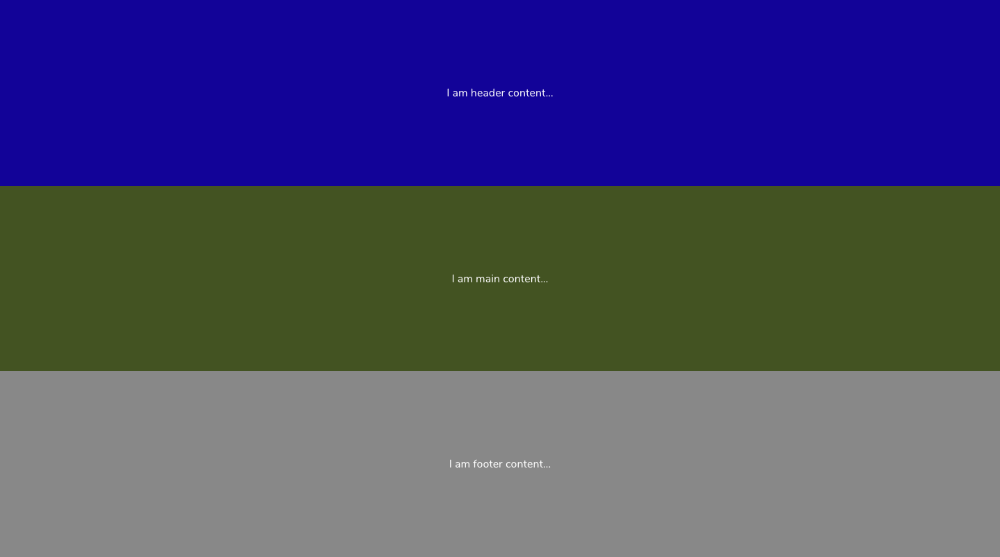

# ReactStrap

ReactStrap is a slim version of Create React App project. It uses a base `HTML` file where `React` injects all its container components.

It comes with a starter Favicon file, Babel presets and Sass stylesheets.

### Tools available

* React
* Sass compiler with Normalize and Nunito Google Font
* Favicon
* Github pages
* ESLint plugin
* Dist Clean plugin
* Image optimization plugin

### Commands

Please install `Parcel` globally on your machine using `yarn global add parcel-bundler`. Once installation is complete, use `yarn dev` to fire up this boilerplate locally. Use `yarn build` to build assets.

### Screenshots

Take a look at sample landing page that comes with this boilerplate.

